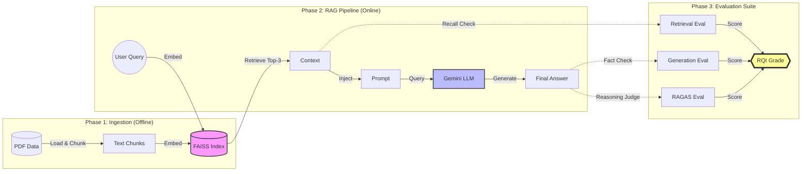

# Enterprise RAG Evaluation Framework

> **A modular, scientifically rigorous framework for building and validating Retrieval-Augmented Generation systems.**

---

## 📌 Executive Summary
This project is not just a chat-with-PDF tool; it is a **comprehensive verification harness** for LLM applications. In production environments, simple RAG implementations often fail due to "silent hallucinations"—where the system retrieves the wrong document but generating a convincing (false) answer.

This framework solves that by introducing a **Unified Quality Index (RQI)** that independently evaluates:
1.  **Retrieval Precision**: "Did we find the right data?"
2.  **Generation Faithfulness**: "Did the LLM stick to the facts?"
3.  **Reasoning Capability**: "Did the system answer the 'Why'?"

---

## 🏗️ Architecture
The system is built on a modular "Ingest-Retrieve-Generate" pipeline using **LangChain Expression Language (LCEL)** for production-grade reliability.



## ⚙️ End-to-End Workflow (Deep Dive)
The system operates in two distinct phases, designed for scalability and traceability:

### Phase 1: Ingestion (Preprocessing)
1.  **Load PDFs** (`src/load_docs.py`): The system reads PDF files from `data/pdfs/`.
2.  **Chunking**: It splits the text into smaller, manageable "chunks" (e.g., 500 characters). *Reasoning: LLMs have a context limit; we cannot feed the whole book, and smaller chunks improve retrieval precision.*
3.  **Embedding** (`src/embed_store.py`): It converts each text chunk into a "Vector" (a list of numbers) that represents its *semantic meaning* using `SentenceTransformers`.
4.  **Indexing**: These vectors are saved into a **FAISS Index**.

### Phase 2: Retrieval & Generation (Runtime)
1.  **User Query**: You ask "Who is HAL 9000?".
2.  **Vector Search**: The system converts your question into a vector and searches the FAISS index to find the 3 paragraphs that are mathematically "closest" to your question.
3.  **Prompt Construction**: It combines your question + the 3 found paragraphs into a single prompt.
4.  **Generation**: It sends this prompt to the LLM (e.g., Gemini).
5.  **Answer**: The LLM answers using *only* the provided facts.

---

## 🧠 Design Decisions & Justifications

### Why FAISS (Facebook AI Similarity Search)?
*   **Speed**: FAISS is written in C++ and optimized for searching billions of vectors. It is significantly faster than Python-based naive comparison.
*   **Local Execution**: Unlike Pinecone or Weaviate, FAISS runs entirely on your machine. This means **zero latency** from network calls and **zero cost**. For a dataset of this size (PDFs), a heavy cloud database is over-engineering.
*   **Portability**: The index is just a file on disk. You can move it or back it up easily.

### Why LangChain Expression Language (LCEL)?
*   **Modern Standard**: We refactored `rag_pipeline.py` to use LCEL (`chain = prompt | llm | output_parser`) instead of the legacy `RetrievalQA` chains.
*   **Robustness**: Legacy chains often break with dependency updates. LCEL is explicit, easier to debug, and allows us to easily swap LLMs (Gemini/Grok/OpenAI) without changing the core logic.

### Why 3 Different Evaluation Methods?
We separate evaluation because a "Bad Answer" can happen for two different reasons: (1) We didn't find the info, or (2) We found it, but the LLM failed to write it.

1.  **Retrieval Eval (`test_retrieval.json`)**: Tests the **Search Engine**. Uses *Keyword Matching*.
    *   *Example*: Query **"First Home Buyer Grant eligibility"**.
    *   *Bad Retrieval*: System finds "Credit Card Rewards T&Cs". (Recall = 0.0)
    *   *Good Retrieval*: System finds "Government Scheme Policy Document Section 4.1". (Recall = 1.0)
2.  **Generation Eval (`test_generation.json`)**: Tests the **LLM's Factuality**. Uses *Keyword Checking*.
    *   *Example*: Query **"What is the maximum LVR for investor loans?"**.
    *   *Check*: The answer *must* contain specific numbers like **"90%"** or **"80%"**. If the LLM explains "Loan to Value Ratio" conceptually but misses the hard cap, it fails compliance.
3.  **RAGAS Eval (`test_ragas.json`)**: Tests **Complex Reasoning**.
    *   **Definition**: In the field of Machine Learning (ML), **RAGAS** is an acronym for *Retrieval-Augmented Generation Assessment Suite*, an open-source framework used for evaluating the performance of RAG pipelines.
    *   **Metrics Used**:
        *   **Faithfulness**: Is the answer derived *only* from the context? (Hallucination Check)
        *   **Answer Relevancy**: Does the answer actually address the user's question?
        *   **Context Precision**: Did we find relevant chunks at the *top* of the list?
        *   **Context Recall**: Did we retrieve *all* the necessary information?
    *   *Example*: **"Can a customer with $80k income and $2k monthly liability service a $500k loan?"**
    *   *Reasoning*: Keywords fail here. The answer requires synthesizing "Serviceability Calculator rules" from Page 12 and "Living Expense Floor" from Page 40. Only an AI Judge can grade if the risk assessment logic is sound.

---

## ⚖️ The RAG Quality Index (RQI)

### The "Pipeline Fallacy"
A common mistake in ML Engineering is averaging component scores naively. 
*   **Scenario**: User asks a question. The system finds *irrelevant* documents (Recall: 0.0) but the LLM hallucinates a perfect-sounding plausible answer (Generation: 1.0).
*   **Naive Metric**: `(0.0 + 1.0) / 2 = 0.5` ("Average Performance").
*   **Reality**: The user was lied to. This is a critical failure.

### Our Solution: Weighted RQI
We use a weighted health metric that penalizes retrieval failure heavily, preventing the "Smooth Liar" problem.

**Formula**: `RQI = (0.4 * Recall) + (0.3 * Code Match) + (0.3 * RAGAS)`

| Grade | Score | Status | Business Impact |
| :--- | :--- | :--- | :--- |
| **A+** | `0.9 - 1.0` | 🟢 **Deploy** | Production Ready. High trust. |
| **A** | `0.8 - 0.9` | 🟢 **Beta** | Excellent pilot candidate. |
| **B** | `0.7 - 0.8` | 🟡 **Refine** | Solid MVP, usable for internal tools. |
| **C** | `0.6 - 0.7` | 🟠 **Debug** | Frequent hallucinations. Do not release. |
| **F** | `< 0.5` | 🔴 **Halt** | Critical Failure. Worse than random chance. |

---

## 🚀 Quick Start

### Prerequisites
*   Python 3.10+
*   Google Gemini API Key (Free Tier)

### Installation
```powershell
# 1. Setup Environment
python -m venv venv
.\venv\Scripts\activate

# 2. Install Dependencies
pip install -r requirements.txt

# 3. Configure Credentials
# Create .env file with: GOOGLE_API_KEY=your_key
```

### Usage
**1. Index Data** (Process PDFs):
```powershell
python src/load_docs.py
python src/embed_store.py
```

**2. Chat Interactively**:
```powershell
python main.py --llm_provider gemini
```

**3. Run Verification Suite**:
```powershell
# Generate Synthetic Test Data (Automated)
python src/generate_synthetic_data.py --llm_provider gemini --num_samples 10

# Run All benchmarks
python src/eval_retrieval.py --test_file data/test_retrieval_synthetic.json
python src/eval_generation.py --test_file data/test_generation_synthetic.json --llm_provider gemini
python src/eval_ragas.py --test_file data/test_ragas_synthetic.json --llm_provider gemini

# Get Final Report Card
python src/aggregate_scores.py
```

---

### 4. Sample Output Report
When you run `python src/aggregate_scores.py`, the system generates a unified Health Report:

```text
--- RAG Quality Index (RQI) Report ---

Retrieval Score (Recall):   0.80  (Weight: 0.4)
Generation Score (Facts):   0.95  (Weight: 0.3)
RAGAS Score (Reasoning):    0.72  (Weight: 0.3)
----------------------------------------
Final RQI Score:            0.82 / 1.00
System Grade:               A
----------------------------------------

[SUCCESS] System is healthy across all metrics.
```

---

## 🔮 Future Roadmap (Production Scale)
To scale this from a prototype to an enterprise search engine:
1.  **Hybrid Search (RRF)**: Combine Vector Search with Keyword Search (BM25) to handle acronyms and IDs better.
2.  **Cross-Encoder Re-Ranking**: Implement a second-pass re-ranker (e.g., `ms-marco`) to score the top 10 results, improving precision by ~15%.
3.  **Hyperparameter Optimization**: Automated jobs to tune `chunk_size` (e.g., 256 vs 512 tokens) and `overlap` to maximize the RQI score.
