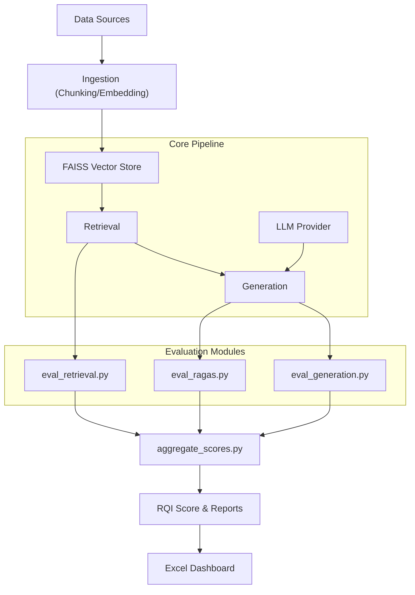

# Project Veritas - RAG Evaluation Framework

## 1. Overview & Goals
**Aim**: To build a robust, observable pipeline for evaluating Retrieval-Augmented Generation (RAG) systems.
**Core Metric**: **RQI (RAG Quality Index)** - A composite score (0-1) derived from Retrieval Quality, Generation Accuracy, and RAGAS metrics.

**Key Goals**:
- **Quantify Quality**: Move beyond "vibes" to numeric scores.
- **Traceability**: Track how changes in prompts (v0, v1, v2...) affect output quality.
- **Observability**: detailed logging of intermediates (retrieved chunks, raw answers).
- **Dashboarding**: Excel/Tableau ready exports for stakeholders.

## 2. Architecture
The system is modular, ensuring evaluators can run independently.



## 3. Usage Steps

### A. Environment Setup
1. Ensure `.env` is populated with API keys (`OPENAI_API_KEY`, `GROQ_API_KEY`, etc.).
2. Install dependencies: `pip install -r requirements.txt`

### B. Standard Evaluation Run
Runs the full suite (Retrieval + Generation + RAGAS) using the default or specified LLM.
```bash
python src/run_eval.py --llm_provider groq --run_name run_001
```

### C. Prompt Impact Analysis (The "Cool" Feature)
Compares multiple prompt versions (defined in `run_eval.py`) against each other.
```bash
python src/run_eval.py --llm_provider groq --prompt_versions prompt_v0,prompt_v1,prompt_v2
```
*Outputs*: `data/prompt_versions/prompt_impact_analysis.json`

### D. Generate Dashboards
Converts the JSON impact analysis into a rich Excel dashboard.
```bash
python src/export_results.py      # Flattens JSON -> Excel
python src/create_dashboard.py    # Excel -> Dashboard with Charts/Deltas
```

## 4. File Guide & Responsibilities

| File | Responsibility |
| :--- | :--- |
| **`src/rag_pipeline.py`** | **The Core**. Contains `rag()` function. Handles FAISS loading, LLM connection (OpenAI/Groq/etc), Prompt formatting, and retries (rate limits). |
| **`src/run_eval.py`** | **Orchestrator**. Runs the sequence of eval scripts. Manages "Prompt Version" loops, env vars, and result aggregation. |
| **`src/embed_store.py`** | **Ingestion**. Handles creating embeddings (Vertex/OpenAI) and saving/loading the FAISS index. |
| **`src/eval_retrieval.py`** | Check `Eval Deep Dive` below. |
| **`src/eval_generation.py`** | Check `Eval Deep Dive` below. |
| **`src/eval_ragas.py`** | Check `Eval Deep Dive` below. |
| **`src/aggregate_scores.py`** | Reads individual score JSONs (`retrieval_score.json` etc.) and computes weighted average (RQI). |
| **`src/export_results.py`** | ETL. Flatten nested JSON report to Tidy CSV/Excel. |
| **`src/create_dashboard.py`** | Analytics. Adds Pivot tables, Heatmaps, and Delta vs Baseline analysis to the Excel file. |

## 5. Evaluation Modules - Deep Dive

### `src/eval_retrieval.py`
- **Goal**: Measure **Retrieval Quality** (Did we find the right chunks?).
- **Input**: `data/test_retrieval.json` (Queries + `expected_keywords`).
- **Logic**: 
  1. Retrieve top-k chunks for query.
  2. Check if keywords exist in the chunks.
- **Output**: `retrieval_score.json` (scalar 0-1).
- **Justification**: Fast, cheap proxy for Recall. If the keyword isn't in the context, the LLM usually can't answer.

### `src/eval_generation.py`
- **Goal**: Measure **Answer Factuality** (Did the LLM mention key terms?).
- **Input**: `data/test_generation.json` (Queries + `expected_keywords`).
- **Logic**:
  1. Run full RAG pipeline.
  2. Check if keywords exist in the *final answer*.
- **Output**: `generation_score.json` (scalar 0-1).
- **Justification**: Ensures the model isn't hallucinating or ignoring critical entities.

### `src/eval_ragas.py`
- **Goal**: **Deep Semantic Evaluation**.
- **Input**: `data/test_ragas.json` (Queries + `ground_truth`).
- **Logic**: Uses `ragas` library to compute:
  - **Context Precision/Recall**: Quality of retrieval vs ground truth.
  - **Faithfulness**: Is answer derived *only* from context?
  - **Answer Relevancy**: Does answer address query?
- **Output**: `ragas_results.csv` (detailed) + `ragas_score.json` (average).
- **Justification**: Industry standard for Reference-free eval. Catches subtle hallucinations and verbosity issues.

## 6. The RQI System (Synthesis)
The **RQI** is calculated in `aggregate_scores.py`:

$$
RQI = (w_r \times Retrieval) + (w_g \times Generation) + (w_{rg} \times RAGAS)
$$

*Current Weights*: 
- **$w_r$ (Retrieval)**: 0.4 (Foundation)
- **$w_g$ (Generation)**: 0.3 (Accuracy)
- **$w_{rg}$ (RAGAS)**: 0.3 (Complexity)

This single number allows tracking "System Health" over time.
